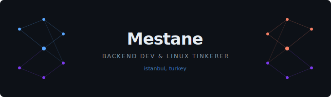
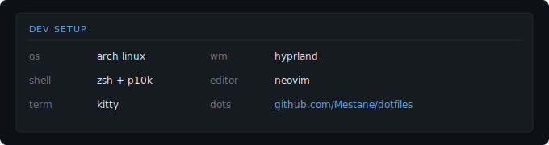

  

  

  

**Open Source**

<!-- contributions-start -->
- **[caelestia-dots/cli](https://github.com/caelestia-dots/cli)** — The main control script for the Caelestia dotfiles
  -  [#112](https://github.com/caelestia-dots/cli/pull/112) fix: Lua dispatcher compat

- **[caelestia-dots/shell](https://github.com/caelestia-dots/shell)** — ‼️ No waybar here ‼️
  -  [#1493](https://github.com/caelestia-dots/shell/pull/1493) fix: prevent slider snapping back after seek

<!-- contributions-end -->

  

**Projects**

| project | description | stack |
|---|---|---|
| [dotfiles](https://github.com/Mestane/HaLLaC_Hypr) | arch linux + hyprland configuration | zsh |

  

**Tech**

  

  

  

  

