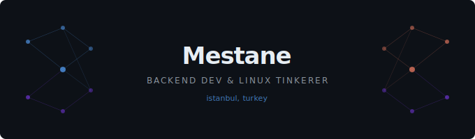

  

---

**open source**

<!-- contributions-start -->
- [caelestia-dots/shell](https://github.com/caelestia-dots/shell) — quickshell-based hyprland desktop environment
<!-- contributions-end -->

---

**projects**

| project | description | stack |
|---|---|---|
| [dotfiles](https://github.com/Mestane/HaLLaC_Hypr) | arch linux + hyprland configuration | zsh |

---

**tech**

  

---

  

---

