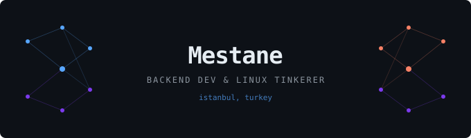
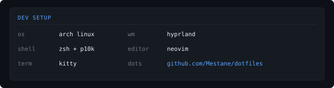

  

  

  

**Open Source**

<!-- contributions-start -->
- **[caelestia-dots/cli](https://github.com/caelestia-dots/cli)** — The main control script for the Caelestia dotfiles
  -  [#173](https://github.com/caelestia-dots/cli/pull/173) fix(record): don't block on stopped notification
  -  [#172](https://github.com/caelestia-dots/cli/pull/172) fix: recorder
  -  [#171](https://github.com/caelestia-dots/cli/pull/171) fix: don't let slurp wait on inherited stdin

- **[caelestia-dots/shell](https://github.com/caelestia-dots/shell)** — A fluid, morphing shell for your Linux desktop
  -  [#1997](https://github.com/caelestia-dots/shell/pull/1997) fix: last row
  -  [#1864](https://github.com/caelestia-dots/shell/pull/1864) fix: filter out container virtual interfaces from the ethernet list
  -  [#1891](https://github.com/caelestia-dots/shell/pull/1891) fix(dashboard): don't let the hidden lyrics list take clicks
  -  [#1605](https://github.com/caelestia-dots/shell/pull/1605) feat: VPN section with provider management and live stats
  -  [#1639](https://github.com/caelestia-dots/shell/pull/1639) feat: indexing UI
  -  [#2047](https://github.com/caelestia-dots/shell/pull/2047) fix: utilities record count

- **[saghen/blink.cmp](https://github.com/saghen/blink.cmp)** — Performant, batteries-included completion plugin for Neovim 
  -  [#2617](https://github.com/saghen/blink.cmp/pull/2617) docs: add blink-cmp-deps community source for Maven

<!-- contributions-end -->

  

**Projects**

| project | description | stack |
|---|---|---|
| [dotfiles](https://github.com/Mestane/HaLLaC_Hypr) | arch linux + hyprland configuration | zsh |

  

**Tech**

  

  

  

  

